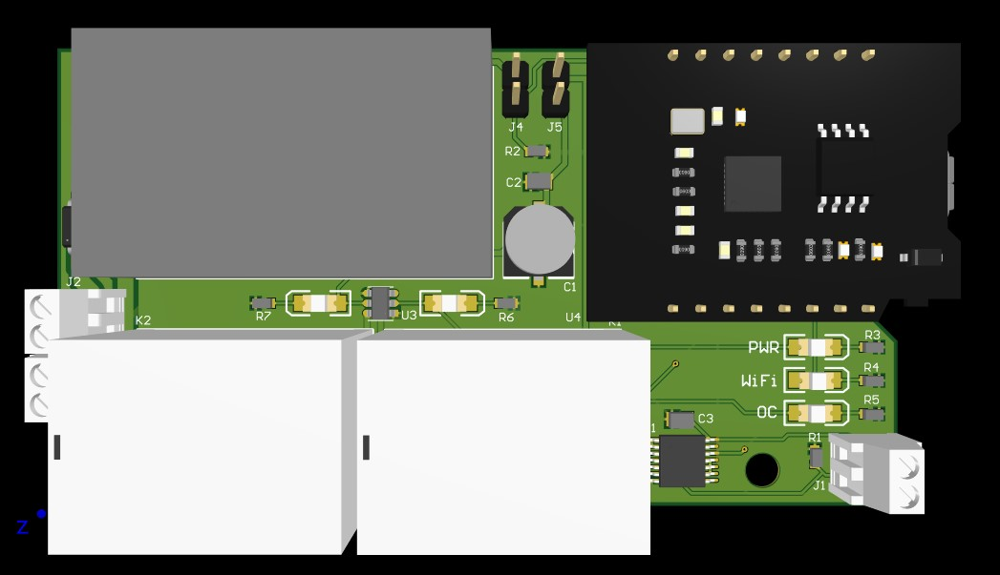
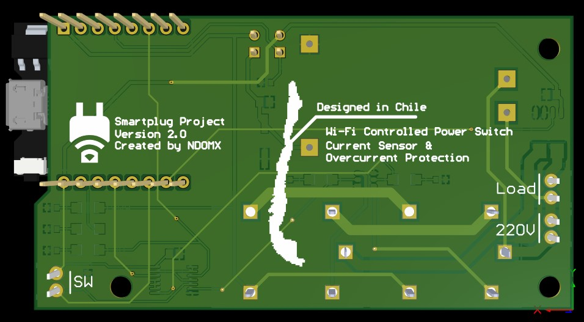
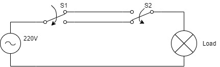
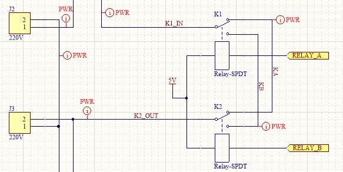

# Smartplug
WiFi controller for home automation

## Description
A smartplug is a device with which you can control the conection of an appliance remotely. As of version 2, I'm using an ESP8266 micro-controller, and controlling it using MQTT.

The schematics are publicly available in this repository, and the fabrication files are available in the releases page. All the required codes are also publicly available here, though you'll have to setup your Arduino IDE to program the MCU. Refer to the [libraries guide](./LIBRARIES_GUIDE.md) to learn how to do it.

## Functionality
The basic operation of the smartplug is fairly simple. It's a commutator circuit just like those lights, found commonly in stairs, that can be controlled by two switches. The circuit goes as follows:

Current can flow through the load (a light bulb) when bith switches are in the same state. The smartplug works the same way, but instead of having two switches, it has two relays that are controlled by the MCU.

The MCU controls both signals, **RELAY_A** and **RELAY_B** that toggle each switch. One control signal is controlled remotely (via MQTT) while the other is controlled by an external switch.

The smartplug has two modes of operation:
1. Take absolute control of the load remotely, i.e. connect/disconnect the load remotely regardless of the external switch input
2. Use the smartplug as a traditional commutator circuit, i.e. the load will toggle every time each control signal is toggled, wether its via MQTT or physical input

> I noticed only one relay is necessary to achieve the same behaviour. So V3 will drop one relay and handle all the logic by software.