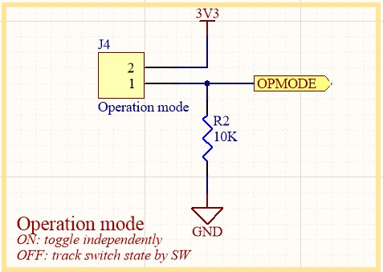
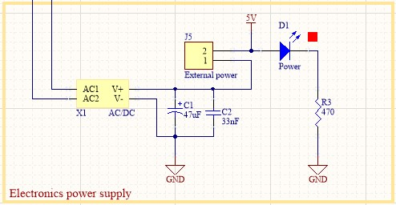
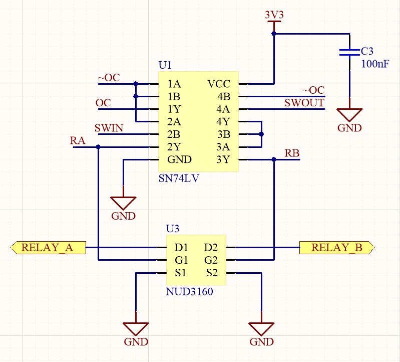
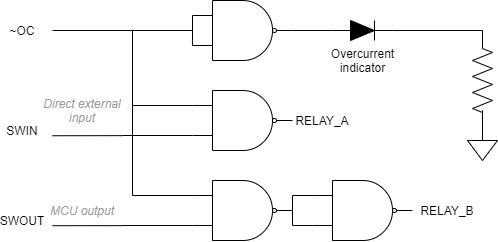

# Smartplug
WiFi controller for home automation

## Description
A smartplug is a device with which you can control the conection of an appliance remotely. As of version 2, I'm using an ESP8266 micro-controller, and controlling it using MQTT.

The schematics are publicly available in this repository, and the fabrication files are available in the releases page. All the required codes are also publicly available here, though you'll have to setup your Arduino IDE to program the MCU. Refer to the [libraries guide](./LIBRARIES_GUIDE.md) to learn how to do it.

## Functionality
### Basics
The basic operation of the smartplug is fairly simple. It's a commutator circuit just like those lights, found commonly in stairs, that can be controlled by two switches. The circuit goes as follows:

Current can flow through the load (a light bulb) when bith switches are in the same state. The smartplug works the same way, but instead of having two switches, it has two relays that are controlled by the MCU.

The MCU controls both signals, **RELAY_A** and **RELAY_B** that toggle each switch. One control signal is controlled remotely (via MQTT) while the other is controlled by an external switch.

The smartplug has two modes of operation:
1. Take absolute control of the load remotely, i.e. connect/disconnect the load remotely regardless of the external switch input
2. Use the smartplug as a traditional commutator circuit, i.e. the load will toggle every time each control signal is toggled, wether its via MQTT or physical input

> I noticed only one relay is necessary to achieve the same behaviour. So V3 will drop one relay and handle all the logic by software.

The mode of operation is controlled by the header J4.

### Power
The PCB traces were calculated for 5A max. In countries with 220V/50Hz supply, this can power 1kW loads. In countries with 110V/60Hz, the max output power is limited to 0.5kW.

On the other hand, all the electronics can be powered by the AC/DC module **X1**, or by external 5V connected to the USB connector, as shown in the image below.

Connect the jumper **J5** to enable power input from the AC/DC module, or leave disconnected and power via USB cable.
> Powering the device via USB cable is meant for uploading the firmware to the MCU. For other purposes, the use of the AC/DC module is recommended

### Current sensing
The smartplug is equipped with an ACS712 current sensor. The current is measured by the MCU ADC and uploaded to the server.

Additionally, if and overcurrent is detected, the OC flag will be activated (~OC as it is active low) and the output will be disabled.

The SN74LV (**U1**) is a quad NAND gate that implements the logic circuit that ensures the load remains unconnected while the OC flag is active.

When ~OC goes low, the outputs **RELAY_A** and **RELAY_B** will go HIGH/LOW repectively, thus, shutting down the load.